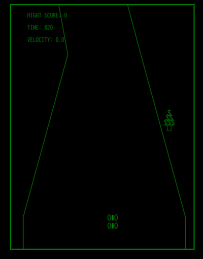

# cart 🏎

Programming CarRace Retro Game in Rust & WebAssembly

[](https://myurioka.github.io/cart/)

[Play in browser](https://myurioka.github.io/cart)

### How to play (Control)

    [PC]
  * Left or Right key : Move left or right the Cart
  * Up key : Speed up the Cart
  * Down key : Straighten the Cart
  * Space key : Brake the Cart

   Sorry, the SP is not suppported. 

### Requirement

  * Rust, Cargo
  * WASM

### How to Build & Run

  ```sh
  $ cd cart
  $ pnpm build-wasm
  $ pnpm dev --open
  ```

### Assets

  * Sound effects are from [GameSounds.xyz](https://gamesounds.xyz)